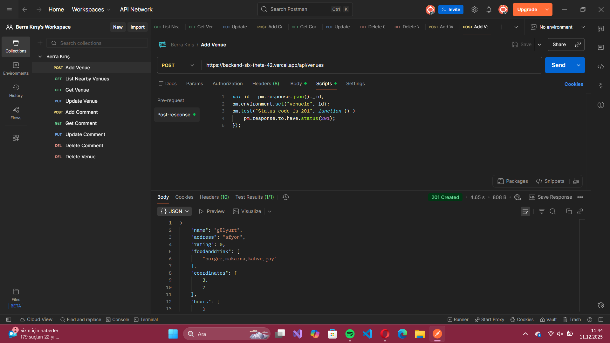
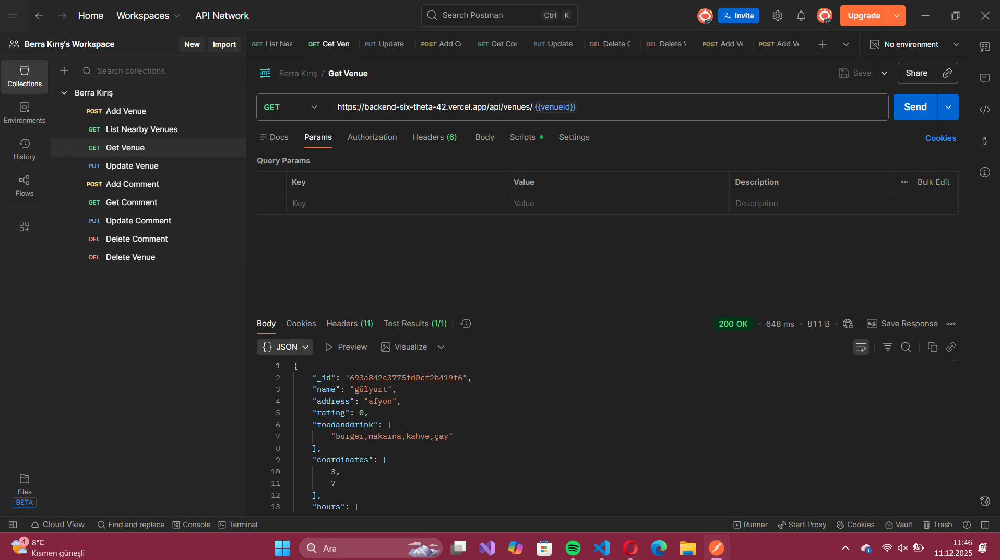
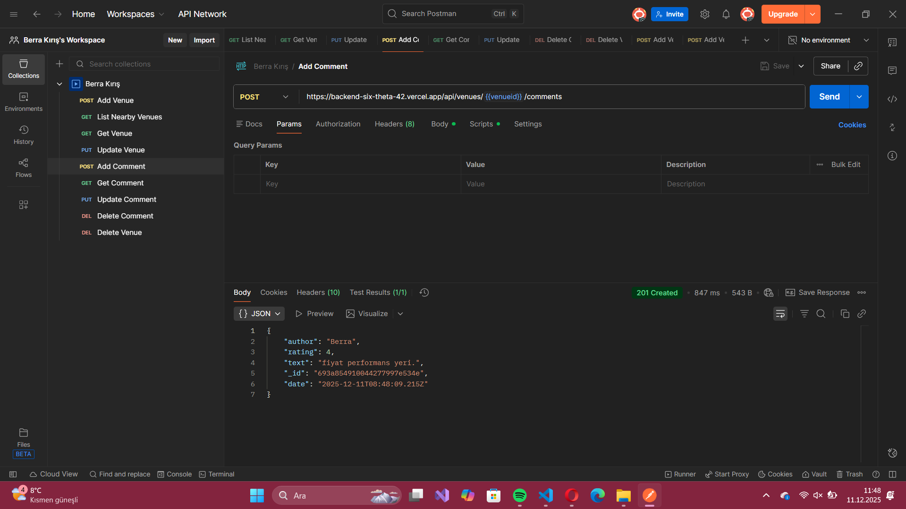
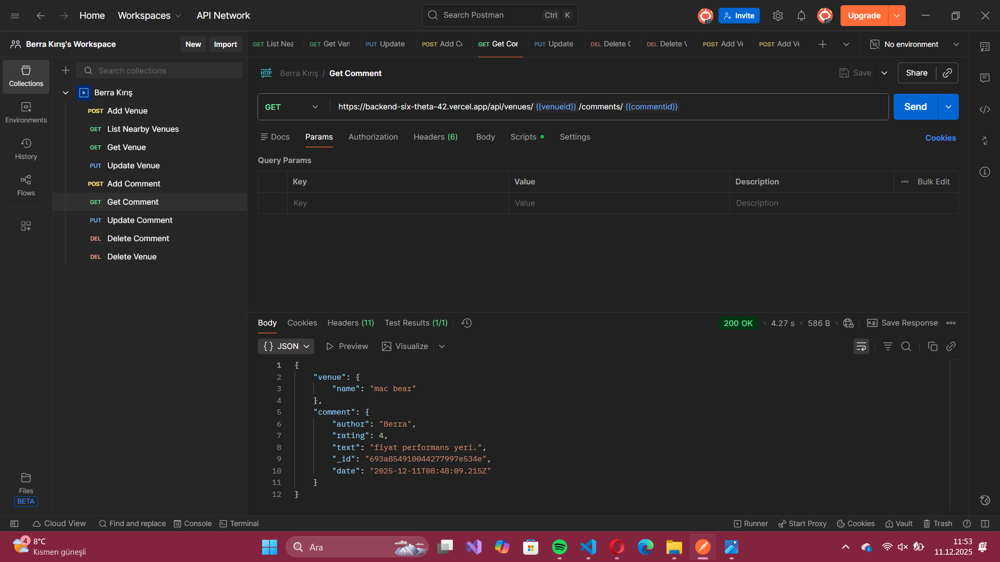

# 🗺️ Venue API & Comment Service


## 📌 Genel Bakış (Overview)

Venue API, konum tabanlı mekan keşfi ve kullanıcı etkileşimi (yorumlar) için tasarlanmış modern bir backend çözümüdür. Bu servis sayesinde geliştiriciler, uygulamalarına hızlıca mekan listeleme ve sosyal geri bildirim özellikleri entegre edebilirler.

🔗 **Canlı Sunucu (Production):** [https://backend-six-theta-42.vercel.app/](https://backend-six-theta-42.vercel.app/)

---

## 📑 İçindekiler (Table of Contents)

1. [Kurulum (Setup)](#-kurulum-setup)
2. [API Özeti (API Summary)](#-api-özeti-api-summary)
3. [Görsel Rehber (Visual Guide)](#-görsel-rehber-visual-guide)
4. [Lisans (License)](#-lisans-license)

---

## ⚡ Kurulum (Setup)

Geliştirme ortamınızı hazırlamak için aşağıdaki komutları sırasıyla terminalinizde çalıştırın.

```sh
# 1. Projeyi yerelinize çekin
git clone <repository-url>

# 2. Proje klasörüne geçiş yapın
cd proje-klasoru

# 3. Gerekli paketleri yükleyin
npm install

# 4. Uygulamayı başlatın
npm run start
```

---

## 📊 API Özeti (API Summary)

| Kaynak | İşlem | Açıklama |
| :--- | :--- | :--- |
| **Venue** | `List Nearby` | Koordinatlara göre çevredeki mekanları getirir. |
| **Venue** | `Add` | Sisteme yeni bir mekan kaydeder. |
| **Venue** | `Update` | Mekan bilgilerini günceller. |
| **Venue** | `Get` | Tek bir mekanın detaylarını sunar. |
| **Venue** | `Delete` | Mekanı veritabanından siler. |
| **Comment** | `Add` | Kullanıcıların yorum yapmasını sağlar. |
| **Comment** | `Update` | Yorum içeriğini değiştirir. |
| **Comment** | `Delete` | Yorumu kaldırır. |

---

## 📷 Görsel Rehber (Visual Guide)

API uç noktalarının nasıl çalıştığına dair ekran görüntüleri aşağıdadır.

### 📍 Mekan Servisleri

#### Yeni Mekan Oluşturma
Veritabanına isim, adres ve koordinat verileriyle yeni bir mekan ekler.


#### Çevredeki Mekanları Bulma
Verilen enlem ve boylam değerlerine göre yakındaki mekanları listeler.


#### Mekan Detayı
ID'si bilinen bir mekanın tüm özelliklerini görüntüler.


#### Bilgi Güncelleme
Mekan verilerinde değişiklik yapmanızı sağlar.


#### Mekan Silme
Mekanı kalıcı olarak sistemden kaldırır.


### 💬 Yorum Servisleri

#### Yorum Gönderme
Kullanıcıların mekanlara puan ve metin içeren yorum bırakmasını sağlar.


#### Yorum Okuma
Belirli bir yorumun detaylarını getirir.


#### Yorum Düzenleme
Mevcut bir yorumun içeriğini veya puanını günceller.


#### Yorum Kaldırma
Yorumu siler.


---